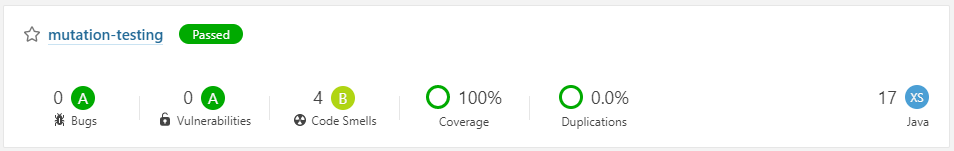

# Mutation Testing [](https://awesome.re)

## :clipboard: Introduction

Most developers are familiar with the concept of unit testing, and how this is useful to ensure the validity of your code, and guard against bugs creeping up in the future. Java developers will typically use [JUnit](https://junit.org/junit5/) to write their unit tests. Many projects use test coverage tools such as [Jacoco](https://www.eclemma.org/jacoco/) to ensure that the code as written has tests to validate it. But how strong are the tests? Will they stand up against bugs introduced by future code changes? 

[Mutation testing](https://en.wikipedia.org/wiki/Mutation_testing) helps ensure that that tests themselves are of high quality by introducing random bugs, or mutations, and checking if any of the unit tests can catch the bug. While this concept has been around for a while, it is just recently that good tools are becoming available for this purpose. One such tool is [PIT](https://pitest.org/).

## :cloud: Getting Started

Follow along this notes. You only will need to have at least [Docker](https://www.docker.com/) installed. All requirements mut be encapsule in docker image and containers using `docker-compose`. 

Clone this repository, and fire up a command-line tool.

> To know the testing technique mutation tests, It necessary check diff between _fake-coverage_ and _true-coverage_

## :computer: Commands to execute

Must be enabled unit test _OperationMutationTest_ to compare results and execute:

```
docker-compose -f docker/docker-compose.yml --env-file=.env up -d
```
Wait for sonarqube to complete startup... You can check accessing to [sonarqube](http://localhost:19000)
```
docker exec -it desktop /bin/bash
gradle sonarqube
```



_Note: If request credentials in sonarqube access, you can use **admin:admin**_

## :octocat: Can you support me?

I will continue to do things and expose notes, but existing many ways to support what I do:
* Pull requests are welcome a :dizzy:
* Don't forget to give this Repository a :star2:
* <a href="https://www.buymeacoffee.com/pedringcoding" title="Donate to this content using BuyMeACoffee">Buy me a :coffee:</a>
